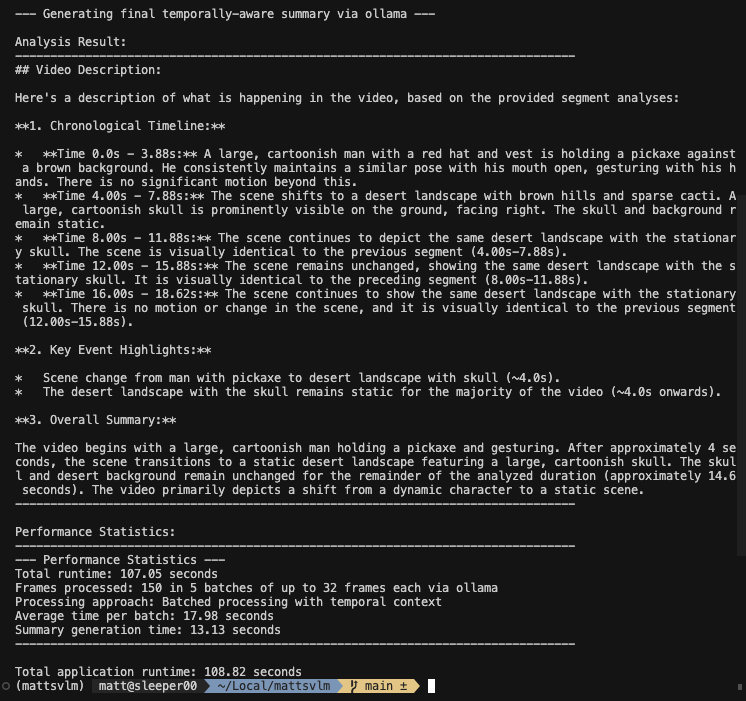

# Matt's VLM Pipeline

[](https://opensource.org/licenses/MIT) [](https://www.python.org/downloads/)

A standalone Python module for processing video clips up to 1 minute in length using Vision Language Models. This was a POC idea VAST Data has allowed me to share with the world. 🌎

<div align="center">


</div>

## Overview

This system implements a novel approach to video analysis by leveraging Vision Language Models (VLMs) through the Ollama framework. It performs temporal decomposition of video content through frame extraction, processes these frames using a multimodal Large Language Model (LLM), and generates semantically meaningful analysis based on user-defined prompts. This represents a significant advancement in video understanding, as it enables temporal alignment and contextual comprehension of video sequences using standard multimodal LLM architectures.

<div align="center">




image.png

</div>

## Features ⚡️

- 🎥 Extract frames from video files at a specified rate
- 🧠 Process video content with a VLM (using Ollama with gemma3)
- 📝 Analyze video based on custom text prompts
- ⏱️ Support for videos up to 60 seconds in length
- ⚙️ Configuration via environment variables or .env file
- ☁️ Support for remote Ollama / OpenAI servers

## Prerequisites 📕

- 🐍 Python 3.12 or higher
- ✨ uv (https://github.com/astral-sh/uv)
- 🔥 An LLM service running:
  - **Ollama:** Installed and running locally or remotely.
  - **OpenAI:** An OpenAI endpoint with multiple image support.

## Installation

1. Clone this repository:
   ```
   git clone <repository-url>
   cd mattsvlm
   ```

2. Create and activate a virtual environment using uv:
   ```
   uv venv -p 3.12
   source .venv/bin/activate  # On Windows use `.\.venv\Scripts\activate`
   ```

3. Install dependencies:
   ```
   uv pip install -r requirements.txt
   ```

4. Create a `.env` file to configure the service endpoint and model:
   ```
   cp .env.example .env
   # Edit .env with your configuration (see Configuration section below)
   ```

## Configuration (`.env` file)

Create a `.env` file in the project root (you can copy `.env.example`) and set the following variables:

```dotenv
# --- Endpoint Selection ---
# Specify the service to use: "ollama" or "openai"
ENDPOINT_TYPE=ollama

# --- Ollama Configuration (if ENDPOINT_TYPE=ollama) ---
OLLAMA_HOST=http://localhost:11434 # Or your remote Ollama URL
OLLAMA_MODEL="gemma3:27b-it-qat"       # Or another Ollama VLM model name

# --- OpenAI Configuration (if ENDPOINT_TYPE=openai) ---
OPENAI_API_KEY="YOUR_OPENAI_API_KEY"     # Your OpenAI API key
OPENAI_MODEL="gemma3"                  
# Optional: Specify a custom base URL for OpenAI-compatible endpoints
# OPENAI_BASE_URL="http://your-proxy-or-local-endpoint:8000/v1"
```

**Important:** Make sure to replace `"YOUR_OPENAI_API_KEY"` with your actual key if using OpenAI.

> ***I've observed different results on the SAME model using the Ollama vs. OpenAI endpoint.***

## Usage 💻

Basic usage (uses settings from `.env`):
```
uv run python app.py sample/chunk_0002.mp4 "describe what is happening in this video"
```

With custom frame rate:
```
uv run python app.py video.mp4 "identify objects in the scene" -fps 12
```

Arguments:
- `video_file`: Path to the video file (MP4/H264 format)
- `prompt`: (Optional) Text prompt for the VLM (default: "summarize what is happening")
- `-fps`, `--frames-per-second`: (Optional) Frames per second to extract (default: 8)
- `-bs`, `--batch-size`: (Optional) Max frames per batch (default: auto-calculated)

## Remote LLM Servers ☁️

- **Ollama:** Set the `OLLAMA_HOST` in your `.env` file.
- **OpenAI:** The system uses the official OpenAI API by default. Set `OPENAI_API_KEY`. If you use a proxy or compatible endpoint, set `OPENAI_BASE_URL` in your `.env` file.

## Examples ✅

Summarize video content:
```
uv run python app.py myvideo.mp4
```

Identify clothing:
```
uv run python app.py myvideo.mp4 "outline the clothing worn by the characters" -fps 10
```

## Limitations ⚠️

- Maximum video length currently tested: ~60 seconds (may vary based on model/memory)
- Requires a configured and running LLM service (Ollama or OpenAI API access)
- Higher extraction fps or larger batch sizes increase processing time and API costs (if applicable).

## Contact ✉️


**Matthew Rogers**

[](https://github.com/RamboRogers) [](https://x.com/rogerscissp) [](https://www.linkedin.com/in/matthewrogerscissp/)

**VAST Data**

You should totally follow VAST Data!

[](https://www.linkedin.com/company/vast-data) [](https://x.com/VAST_Data)


## License MIT

Copyright (c) 2024 VAST Data

Permission is hereby granted, free of charge, to any person obtaining a copy
of this software and associated documentation files (the "Software"), to deal
in the Software without restriction, including without limitation the rights
to use, copy, modify, merge, publish, distribute, sublicense, and/or sell
copies of the Software, and to permit persons to whom the Software is
furnished to do so, subject to the following conditions:

The above copyright notice and this permission notice shall be included in all
copies or substantial portions of the Software.

THE SOFTWARE IS PROVIDED "AS IS", WITHOUT WARRANTY OF ANY KIND, EXPRESS OR
IMPLIED, INCLUDING BUT NOT LIMITED TO THE WARRANTIES OF MERCHANTABILITY,
FITNESS FOR A PARTICULAR PURPOSE AND NONINFRINGEMENT. IN NO EVENT SHALL THE
AUTHORS OR COPYRIGHT HOLDERS BE LIABLE FOR ANY CLAIM, DAMAGES OR OTHER
LIABILITY, WHETHER IN AN ACTION OF CONTRACT, TORT OR OTHERWISE, ARISING FROM,
OUT OF OR IN CONNECTION WITH THE SOFTWARE OR THE USE OR OTHER DEALINGS IN THE
SOFTWARE.
